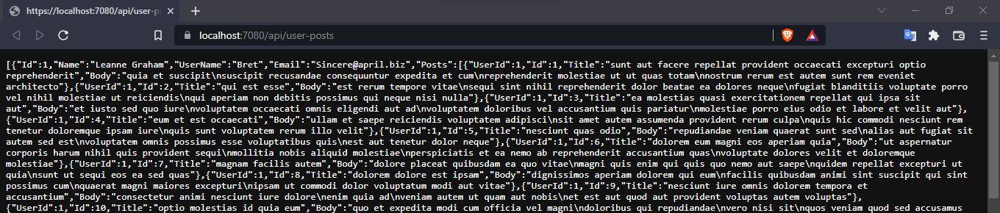

# Building a Web API with ASP.NET Core

### Step 1.- Project creation

### Step 2.- Project's name

### Step 3.- Additional Information

### Step 4.- Install ocelot library

### Step 5.- Run project

### Step 6.- Web APIs

### Step 7.- Formatting Web APIs using extension  JSON Formatter

### Step 8.- Project publication

### Step 9.- I use azure to publish

### Step 10.- URL where the project is deployed

